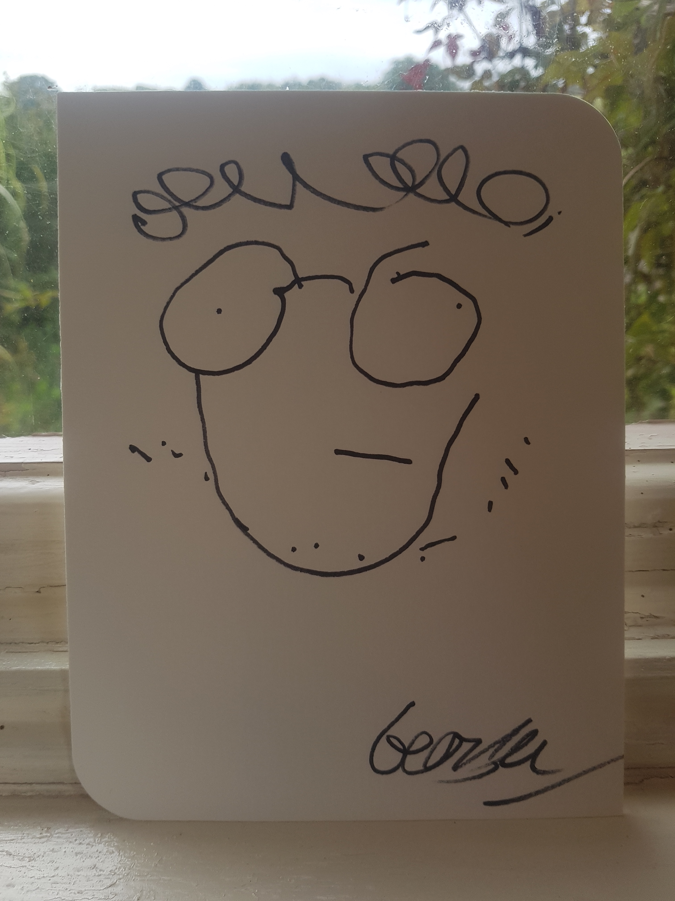

# Founders and Coders Application: My Website - Summer 2023 Cohort

## Repository Contents:

1. index.html - Website HTML.
2. styles.css - The styles for my website.
3. index.js - The JavaScript for my website.
4. images - Contains all the images used in this repository.

My main website for my FaC application! It contains some information about me and why I want to join FaC. It also contains my project gallery which links to the other projects in my application portfolio. My favicon is based on a self portrait I made blindfolded during a country retreat:

